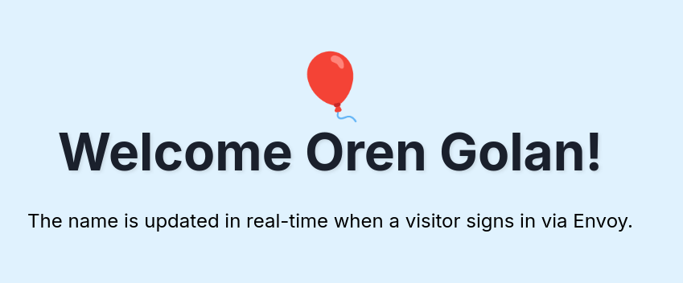
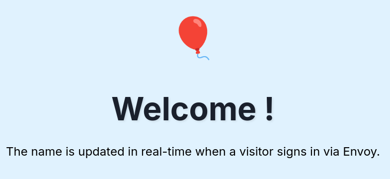

# Guide for Building an Envoy App

## Introduction
This is a how-to guide for creating a web application that greets visitors by their name. It integrates with the Envoy platform.

At the end of the guide, we will have a website that looks like this: 

The audience for the guide is someone with basic development skills and familiarity with JavaScript, Node.js, HTML, and CSS.

## High-Level Overview

The guide has 3 parts:
1. Build a small Express.js app that serves an HTML page.
1. Register the app in Envoy.
1. Use the app by signing in a visitor using the Envoy platform.

## Step 1: Build the App

Before building the app, let's discuss the flow between Envoy and our app, and the technology choices we made.

When a visitor signs in using Envoy, Envoy uses a Webhook (HTTP POST) to notify our app about the event. Our app extracts the name of the visitor and updates the UI with that name. The UI refreshes itself every 5 seconds. Instead of refreshing the UI, we could have used WebSockets, but this would complicate the code, and we chose the simplest and most straightforward solution. The UI also displays a balloon that flies up. We use CSS animations instead of an external JavaScript library because we wanted to keep things simple.

For the deployment option, we chose to keep the app on your machine. We are using a tool called [`ngrok`](https://ngrok.com/) for this. In the real world, you should deploy it on a cloud provider such as AWS or Heroku.

Enough with talking. Let's start building!

First, create a new folder called 'welcome'. Inside, you need 2 files ('package.json' and 'server.js') and a folder called 'views'. Inside that folder, you need a file called 'index.ejs'. To save you some time, copy the content of those 3 files from [this GitHub repository](https://github.com/oren/my-plugin/tree/main/welcome).

Below is what you should end up with:
```bash
├── package.json
├── server.js
└── views
    └── index.ejs
```

Install the NPM dependencies
```bash
cd welcome
npm install
```

Run the app
```bash
node server.js
```

Open the broswer at http://localhost:8000 and verify that you see the welcome page:


Amazing! Now, let's take a brief look at the important parts of our app. If you just want to complete the guide without understanding how things work, feel free to skip to Part 2.

First, let's look at the dependencies we have in 'package.json'. The important one is the Envoy Node.js SDK. It provides us with a middleware that is needed for integrating our app with Envoy.
```javascript
  "dependencies": {
    "ejs": "^3.1.10",
    "express": "^5.1.0",
    "@envoy/envoy-integrations-sdk": "^1.5.0"
  }
```

Let's take a look at our 'server.js' file. This file has the endpoint that will receive the request from Envoy (the webhook). This will be called after we register and set up our app on the Envoy platform (Step 2 of this guide). Whenever a visitor signs in, this endpoint will be called, and our app sets the `latestVisitorName`. Every 5 seconds, the HTML will re-render itself with the new visitor.
```javascript
app.post('/visitor-sign-in', async (req, res) => {
  const envoy = req.envoy; // our middleware adds an "envoy" object to req.
  const job = envoy.job;
  const visitorName = envoy.payload.attributes['full-name'];

  if (visitorName) {
    console.log(`New visitor signed in: ${visitorName}`);
    latestVisitorName = visitorName;
  }

  res.send({ success: true });
});

```

## Step 2: Register the App with Envoy

Before you continue to Step 2, we need to expose our app to the internet. Install [`ngrok`](https://ngrok.com/), and in another terminal, run this command:
```bash
ngrok http http://localhost:8000
```

You will see output like this:
```bash
https://c6b6-2601-645-8800-7180-581e-114a-6179-b578.ngrok-free.app -> http://localhost:8000
```

The long URL is the public URL of your app. Copy it because you'll need it soon.

Create a [free acconut with Envoy](https://signup.envoy.com) and navigate to the [Dev Dashboard](https://dashboard.envoy.com/dev-dashboard).

In the 'My Integrations' page do the following:
* Click on 'Create New'
* Name: Greeting Visitors
* Description: Greeting Visitors
* 'Logo URL' and 'Small Logo URL': https://dashboard.envoy.com/assets/images/logo-small-red.svg
* API Scopes: 'entries.read'
* Check the 'From Envoy dashboard'
* Check 'Yes, display on the integration page'
* Under 'Event hook' click 'Add event hook'.
* Webhook URL: Enter the public URL of your app and add '/visitor-sign-in' at the end
* Trigger: Visitor sign-in

Under 'Setup Steps' do the following:
* Name: Greetings
* Type: Form
* Click 'Add a field'
* Label: Preferred Hello
* Type: Select
* Note: What greeting you want?
* Key: HELLO
* Options URL: Enter the public URL of your app and add ''/hello-options' at the end
* Check the 'Required'

Copy the Client ID and the Client Secret. Your app needs both as environment variables. There are multiple ways to add them to the app; I add them to my '~/.bashrc file':
```bash
export ENVOY_CLIENT_SECRET="xxxxxxxxxxxxxxxxxxxxxxxxxxxxxxxxxxxxxxxxxxxxxxxxxxxxxxx"
export ENVOY_CLIENT_ID="xxxxxxxx-xxxxxxx-xxxxx-xxxxxxx"
```

Go back to the terminal that runs your Node server (not ngrok; keep ngrok running).
Shutdown your Node server using Ctrl+C. Now include the new environment variables using this command: source `~/.bashrc`. Now re-run your app using `node server.js`.

## Step 3: Use the App

On the Envoy dashboard, click on 'Integrations,' then click on 'Custom Integrations.' You should see your app. Click 'Install.' Select 'Configure.' It will ask you for your preferred HELLO. Click on 'Complete Setup.'

Note: This step is not used by your app, but it is required.

On the Envoy dashboard, click on 'Visitors' and do the following:
* Click 'Sign in visitor'
* Full Name: Josh Mercer
* Click 'Sign in'

Go to the public URL of your app, and you should see 'Welcome Josh Mercer!' with a balloon flying.

Congratulations 🏆✨🙌! You built a web app that integrates with the Envoy platform and greets visitors.
